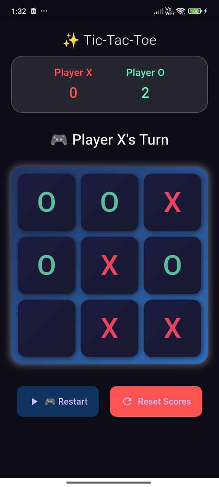
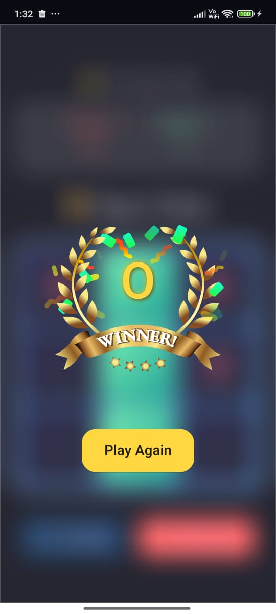
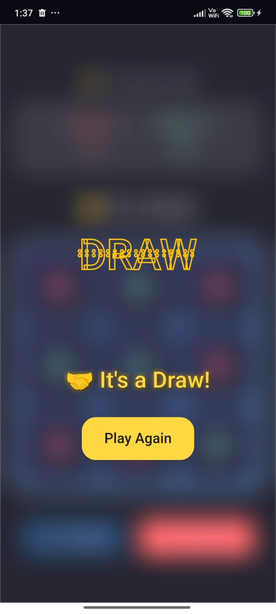

# Tic-Tac-Toe Flutter App 🎮

A **modern Tic-Tac-Toe game** built with **Flutter**, featuring smooth animations, Lottie effects, and a clean dark-themed UI. Play against a friend on the same device, track scores, and enjoy interactive win/draw animations.

---

## Features ✨

- **Two-player gameplay** (X vs O) on the same device
- **Win detection** with animated highlights for winning lines
- **Draw detection** with animated “Draw” text
- **Scoreboard** to keep track of Player X and Player O
- **Play Again & Reset Scores** buttons
- **Modern UI/UX** with frosted glass effect and gradients
- **Lottie animations** for win and draw scenarios
- Cross-platform: Runs on **Android** and **iOS**

---

## Screenshots 🖼️

## Screenshots 🖼️

  
  
  

 

---

## Getting Started 🚀

### Prerequisites

- Flutter SDK installed: [Install Flutter](https://flutter.dev/docs/get-started/install)
- IDE: VS Code / Android Studio
- Device / Emulator for testing

 
